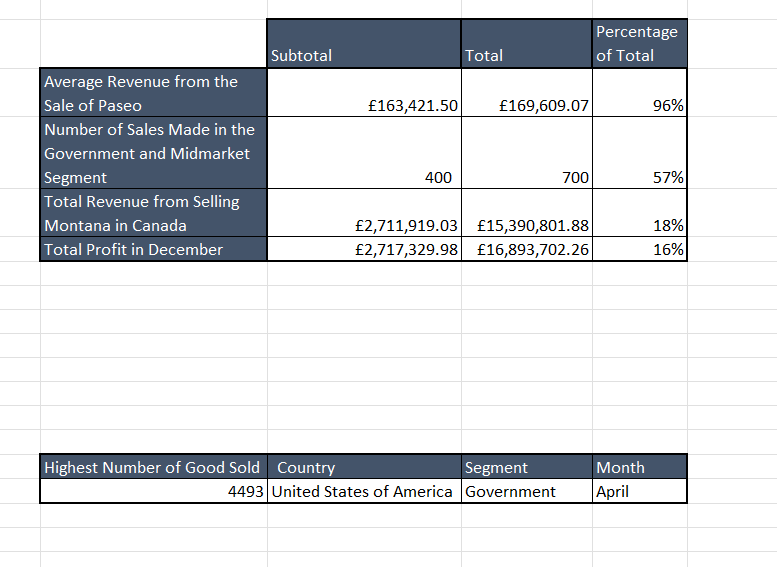

# Sales-Report-for-Company-X

## Introduction

The aim of this task is to show my knowledge and skill in analysing data using Advanced Excel Functions such as the Lookup Functios and the Conditional Functions. 

**_Disclaimer:_** _All dataset used are dummy dataset and do not represent any company or institution._

## Problem Statement

1.	What is the average revenue generated from each Sale of Paseo from the Sales Record?
2.	What is the number of sales made in the Government and Midmarket Segment?
3.	What is the total revenue from the sales of Montana in Canada?
4.	In which country, segment and month was the highest unit of goods sold?
5.	What is the total profit made in December?

## Skills Demonstrated
- Basic Excel Functions (SUM, MAX): to calculate values within a range of columns/cells
- Lookup Functions (XLookup): to look up values within the range of data.
- Conditional Functions (SUMIFS, SUMIF, COUNTIF): to count and calculate values from a range with specific and multiple conditions. 

## Data Sourcing

This data was obtained from the Sales Record provided in the Data Analytics Cohort 4 Repository. The data contains 1 sheet which has a table containing 700 rows and 16 columns

## Data Cleaning and Transformation

The data provided was cleaned but data filtering (such as formatting the text and number types) was done to make sure the data does not return error during the analysis.

## Data Modelling

This was not done as it this is not required for the task.

## Analysis and Visualisation

From the analysis, the following observations were made:
- Paseo made up 96% of the Total Average of all the products sold in the Sales Record.
- Government and Midmarket make up 57% of the Total Segment in the Sales Record
- The sale of Montana in Canada makes up 18% of the Total sales of Montana in all countries.
- The highest number of goods sold was in the month of April by the Government Segment in the United States of America
- 16% of the of the organisation’s total profit was made in December.

## Conclusion and Recommendations

The analysis showed that Paseo made more sale than all other products sold in the organisation, selling in the Government and Midmarket segments drove sales in comparison to the other market segments and the organisation made the most sales from selling in the Government segment in the United States of America in April.

Based on the findings of this analysis, the following are recommended for Company X: 
- Invest more in the production of Paseo as it brings majority of the profit for the organisation
- Increase sales in the Government segment as this market segment drives sales in comparison to the other segments
- Increase production of their goods in April and push the sales the Government segment in the United States of America as this are where and when sales is at its peak.
